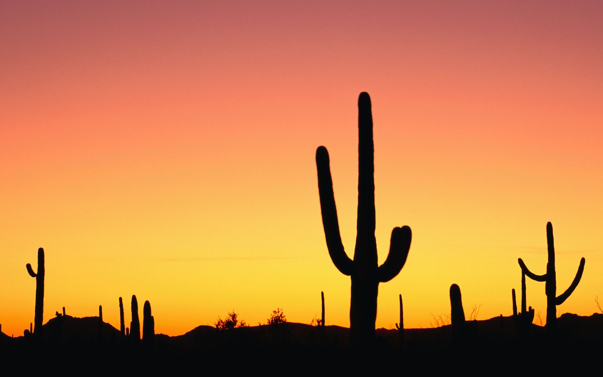

## FOSS Tuesday Group 3 

### Team Members
- Ayanna St Rose
- Cristian Salazar de Leon
- Hardani Maulana
- Nick Kapp
- Sebastian Calleja 

***

***
### Important Links
[Hack MD Notes](https://github.com/CyVerse-learning-materials/foss-spring-2021-hackmd-notes?mc_cid=bd3e73e33f&mc_eid=1aeeb1392b)

[FOSS Website](https://learning.cyverse.org/projects/foss-2020/en/latest/)
 
[Git Cheat Sheet](https://learning.cyverse.org/projects/foss/en/latest/reproducible_science/GitHub.html?mc_cid=bd3e73e33f&mc_eid=1aeeb1392b#git-cheat-sheet)
 
[Playlist of Class Recordings](https://www.youtube.com/playlist?list=PL38WPXpo-ZW2U9_ADIr_oEGmTHlBKQxkV)

### Team Biographies

#### Ayanna St. Rose
In spring of 2019, I began my PhD with Dr. Kusum Naithani, while pursuing a Masters of Science in Biological Statistical Analysis. I am interested in investigating climate-carbon feedback at ground, leaf and landscape scale. I am currently working on an NSF funded project to explore natural genetic variation of photosynthetic machinery in crops to tolerate drought and elevated nighttime temperature. I plan to investigate climate-carbon feedback at landscape scale using landscape and regional models. I intend to utilize data from the National Ecological Observatory Network data, an open access data portal with sites all over the US, and other similar open-data products (e.g., Ameriflux) to study how canopy structure affects biodiversity.

View CV Below:
<embed src="StRose-CV.pdf" type="application/pdf" title="Ayanna's CV" width="100%" height="850px"/>

#### Sebastian Calleja
I am a first year plant science PhD student at the University of Arizona. My current research for the Pauli Lab involves understanding a plant's dynamic response to abiotic stress throughout a growing season. My research is conducted at the Maricopa Agricultural Center, home of the world's largest land phenotyping robot. This robot is equipped with multiple sesnsors which we can leverage to better understand plant physiological traits. I am currently working on extracting information from the robot's FLIR thermal sensor, so we can gain more knowledge about the crop's water dynamics in periods of drought stress.

CV: <a href="https://github.com/sebcalleja/FOSS-Group3/blob/main/SCalleja_CV_2020.pdf" target="_blank">PDF.</a>

#### Cristian Salazar de Leon
I am a first year plant sciences graduate student at the University of Arizona in the Pauli Lab. My current research involves created machine learning AI for the detection of a fungal disease called charcoal rot in sorghum images. In the future, this image data and AI can be used as a case study for educators. I also wish to apply AI for phenotyping characteristics in other crops such as tepary beans and for the diagnosis of other crop diseases.

#### Hardani Maulana
I finished my master study in Informatics at the Technical University of Munich, Germany and currently working as a Full Stack Software Developer at Graz University of Technology under Research Data Management group. I am interested in machine learning, data science, and computer vision. My current project is a part of FAIR Data Austria project, in particular develop a machine actionable Data Management Plan for researcher. This project and other project in my group lead me interested to know more about the open science and its tools.

### Data Management Plan for Ayanna's Thesis:

[DMP](https://docs.google.com/document/d/1-_Tpy8ZK841xk01GVS6GxIfbt_iDv1sEYVTsJPTBKe4/edit?usp=sharing)
